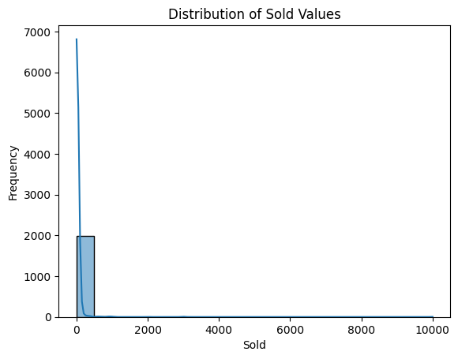
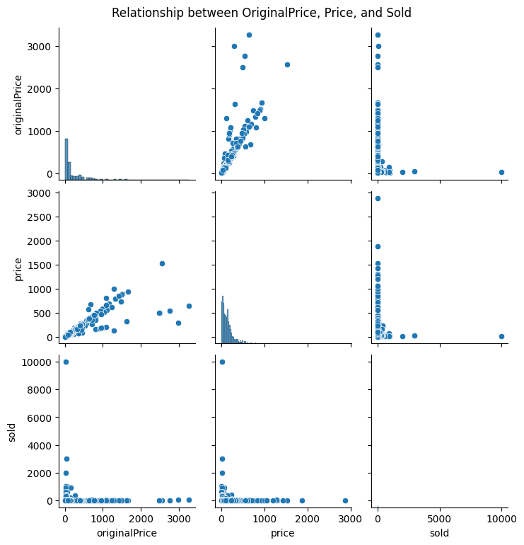

            E-commerce Furniture Dataset 2024

## Project Overview

This project analyzes the E-commerce Furniture Dataset 2024, which contains information on 2,000 furniture products scraped from AliExpress.
The objective is to perform exploratory data analysis (EDA), market trend analysis, price optimization, and predictive modeling to forecast the number of furniture items sold based on product attributes.
## import Libraries
import pandas as pd
import matplotlib.pyplot as plt
import seaborn as sns

### Dataset Information

Source: AliExpress (Scraped Data)

Number of Entries: 2,000

Columns:
productTitle: Name of the furniture product.
originalPrice: Original price before discount.
price: Discounted price of the product.
sold: Number of units sold.
tagText: Additional tags describing the product.
## load Dataset
df = pd.read_csv('ecommerce_furniture_dataset_2024.csv')
print(df.head())
Output:
productTitle originalPrice    price  \
0  Dresser For Bedroom With 9 Fabric Drawers Ward...           NaN   $46.79   
1  Outdoor Conversation Set 4 Pieces Patio Furnit...           NaN  $169.72   
2  Desser For Bedroom With 7 Fabric Drawers Organ...         $78.4   $39.46   
3  Modern Accent Boucle Chair,Upholstered Tufted ...           NaN  $111.99   
4  Small Unit Simple Computer Desk Household Wood...        $48.82   $21.37   
   sold        tagText  
0   600  Free shipping  
1     0  Free shipping  
2     7  Free shipping  
3     0  Free shipping  
4     1  Free shipping

# .Data Preprocessing:-->
The dataset undergoes several preprocessing steps to ensure data quality and usability:
Handling Missing Values:
If any missing values are found, they are either filled using appropriate methods (e.g., mean/median imputation) or removed based on relevance.
Data Type Conversion:
price and originalPrice columns are converted to numeric format.
sold column is ensured to be an integer.
tagText is converted to categorical format if needed.
Feature Engineering:
Creating new features such as discount_percentage = ((originalPrice - price) / originalPrice) * 100.
Encoding categorical variables if necessary.
Outlier Detection & Removal:
Using statistical methods (e.g., IQR) to detect and handle price/sales outliers.

# Check for missing values
print(df.isnull().sum())

productTitle        0
originalPrice    1513
price               0
sold                0
tagText             3
dtype: int64

# Convert price columns to numeric

df['originalPrice'] = pd.to_numeric(df['originalPrice'].replace({r'\$': '', ',': ''}, regex=True), errors='coerce')
df['price'] = pd.to_numeric(df['price'].replace({r'\$': '', ',': ''}, regex=True), errors='coerce')
print(df.originalPrice)
print(df.price)

0         NaN
1         NaN
2       78.40
3         NaN
4       48.82
        ...  
1995      NaN
1996      NaN
1997      NaN
1998      NaN
1999      NaN
Name: originalPrice, Length: 2000, dtype: float64
0        46.79
1       169.72
2        39.46
3       111.99
4        21.37
         ...  
1995     72.49
1996    276.65
1997    196.44

## Exploratory Data Analysis (EDA)

EDA helps uncover patterns, trends, and relationships within the dataset. Key steps include:

Descriptive Statistics:
Summary statistics (mean, median, standard deviation, etc.) for numerical columns.
Frequency distributions for categorical variables.
Data Visualization:
Histograms and box plots to analyze price and sales distributions.
Scatter plots to identify correlations between price, discount, and sales.
Bar charts to examine the most popular product categories.
Correlation Analysis:
Heatmaps to understand relationships between numerical features.
Identifying how price and discount impact the number of items sold.
Trend Analysis:
Time series analysis (if applicable) to examine sales patterns over time.
Seasonal variations in furniture sales.

# Exploratory Data Analysis (EDA)

# Distribution of 'sold' values
sns.histplot(df['sold'], kde=True, bins=20)
plt.title('Distribution of Sold Values')
plt.xlabel('Sold')
plt.ylabel('Frequency')
plt.show()

# Check if the required columns exist and are numeric
required_columns = ['originalPrice', 'price', 'sold']

# Remove any non-numeric characters (e.g., dollar signs) and convert to numeric
df['originalPrice'] = pd.to_numeric(df['originalPrice'].replace({r'\$': '', ',': ''}, regex=True), errors='coerce')
df['price'] = pd.to_numeric(df['price'].replace({r'\$': '', ',': ''}, regex=True), errors='coerce')

# Verify the change and check data types again
print(df.dtypes)

# List numeric columns after cleaning
numeric_columns = df.select_dtypes(include=['int64', 'float64']).columns

# Check if required columns are numeric
missing_columns = [col for col in required_columns if col not in numeric_columns]
if missing_columns:
    print(f"Error: The following columns are either missing or not numeric: {', '.join(missing_columns)}")
else:
    # Plot the relationship between 'originalPrice', 'price', and 'sold' if available
    selected_columns = ['originalPrice', 'price', 'sold']
    sns.pairplot(df[selected_columns], kind='scatter')
    plt.suptitle('Relationship between OriginalPrice, Price, and Sold', y=1.02)
    plt.show()

#  Feature Engineering
from sklearn.feature_extraction.text import TfidfVectorizer

# Convert 'originalPrice' and 'price' columns to numeric type
df['originalPrice'] = pd.to_numeric(df['originalPrice'], errors='coerce')
df['price'] = pd.to_numeric(df['price'], errors='coerce')

# Create a new feature: Percentage Discount
df['discount_percentage'] = ((df['originalPrice'] - df['price']) / df['originalPrice']) * 100

# Check if 'productTitle' exists
if 'productTitle' in df.columns:
    # Handle missing values
    df['productTitle'] = df['productTitle'].fillna('')  

    # Apply TF-IDF Vectorizer
    tfidf = TfidfVectorizer(max_features=1000)
    product_title_tfidf = tfidf.fit_transform(df['productTitle'])

    # Convert TF-IDF matrix to DataFrame
    productTitle_df = pd.DataFrame(product_title_tfidf.toarray(), columns=tfidf.get_feature_names_out())

    # Drop the original 'productTitle' column
    df = df.drop(columns=['productTitle'])

    # Concatenate TF-IDF features with the original DataFrame
    df = pd.concat([df, productTitle_df], axis=1)

    print("✅ TF-IDF Transformation Completed!")
else:
    print("❌ Error: 'productTitle' column is missing from the DataFrame.")

 TF-IDF Transformation Completed!
 
# Model Selection & Training.

from sklearn.model_selection import train_test_split
from sklearn.linear_model import LinearRegression
from sklearn.metrics import mean_squared_error, r2_score
from sklearn.ensemble import RandomForestRegressor
from sklearn.impute import SimpleImputer

# Split the dataset into features (X) and target (y)
X = df.drop('sold', axis=1)
y = df['sold']

# Train-test split (80% train, 20% test)
X_train, X_test, y_train, y_test = train_test_split(X, y, test_size=0.2, random_state=42)

# Imputation using SimpleImputer
imputer = SimpleImputer(strategy='mean')
X_train = imputer.fit_transform(X_train)
X_test = imputer.transform(X_test)

# Initialize models
lr_model = LinearRegression()
rf_model = RandomForestRegressor(n_estimators=100, random_state=42)

# Train the models
lr_model.fit(X_train, y_train)
rf_model.fit(X_train, y_train)

# Make predictions
lr_predictions = lr_model.predict(X_test)
rf_predictions = rf_model.predict(X_test)

# Calculate evaluation metrics
lr_mse = mean_squared_error(y_test, lr_predictions)
lr_r2 = r2_score(y_test, lr_predictions)
rf_mse = mean_squared_error(y_test, rf_predictions)
rf_r2 = r2_score(y_test, rf_predictions)

# Display results
print("Models trained successfully!")

print("\nLinear Regression Model Performance:")
print(f"Mean Squared Error: {lr_mse}")
print(f"R² Score: {lr_r2}")

print("\nRandom Forest Model Performance:")
print(f"Mean Squared Error: {rf_mse}")
print(f"R² Score: {rf_r2}")

Models trained successfully!

Linear Regression Model Performance:
Mean Squared Error: 432077.53701037995
R² Score: -77.79566734067515

Random Forest Model Performance:
Mean Squared Error: 24281.91061748153
R² Score: -3.4281620485286153