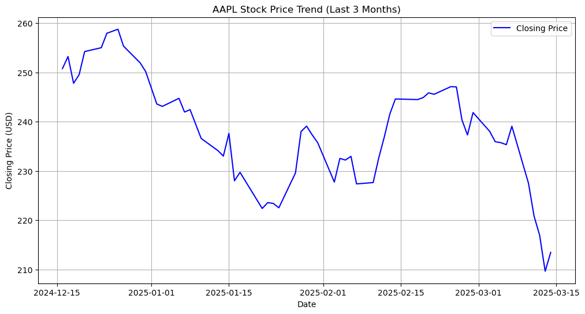
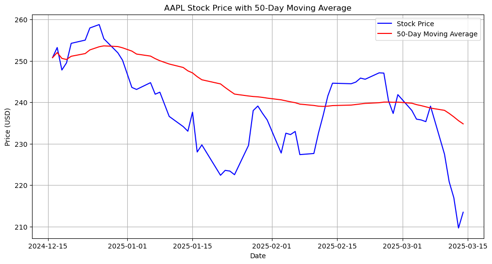
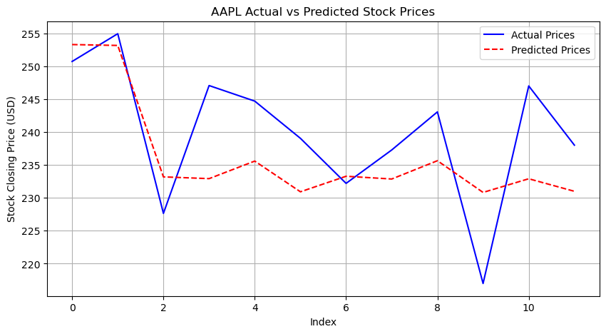

                                                Stock Market Analysis
Overview:

This project involves analyzing stock market data to identify trends, patterns, and potential investment opportunities using Python. The project focuses on historical stock prices, market indicators, and machine learning models to forecast future stock movements.

Features:
1. Import Libraries
2. Data Loading and Preprocessing using Pandas
3. Stock Market Data Fetching using Yahoo Finance API
4. Data Visualization with Matplotlib/Seaborn
5. Feature Engineering for Stock Trend Analysis
6. Machine Learning Model Training and Evaluation
7. Predictive Modeling for Future Stock Prices

1 .# Data manipulation and numerical computations
import pandas as pd  
import numpy as np  

# Data visualization
import matplotlib.pyplot as plt  
import seaborn as sns  

# Fetching stock market data
import yfinance as yf  

# Scikit-learn modules for data preprocessing and modeling
from sklearn.model_selection import train_test_split  
from sklearn.preprocessing import StandardScaler  
from sklearn.linear_model import LinearRegression  
from sklearn.metrics import mean_absolute_error, mean_squared_error, r2_score  

# TensorFlow for deep learning
import tensorflow as tf  
from tensorflow.keras.models import Sequential  
from tensorflow.keras.layers import Dense, LSTM, Dropout  

2. Data Loading and Preprocessing using Pandas:
   # Load dataset
file_path = 'Stocks.csv'  # File path

# Read the CSV file with error handling
df = pd.read_csv(file_path)

# Display basic information about the dataset
print("Dataset Loaded Successfully!")
print(df.info())  # Show column names, data types, and non-null values
print("\nFirst 5 rows of the dataset:")
print(df.head())  # Preview first few rows

Output:
Dataset Loaded Successfully!
<class 'pandas.core.frame.DataFrame'>
MultiIndex: 525 entries, ('Date', 'IBM', 'AAPL', 'MSFT', 'XRX', 'AMZN', 'DELL', 'GOOGL', 'ADBE', '^GSPC') to ('2022-06-28', '141.86000061035156', '137.44000244140625', '256.4800109863281', '15.819999694824219', '107.4000015258789', '48.939998626708984', '2240.14990234375', '365.6300048828125', '3821.550048828125')
Data columns (total 1 columns):
 #   Column                                    Non-Null Count  Dtype 
---  ------                                    --------------  ----- 
 0   # Data source: https://finance.yahoo.com  392 non-null    object
dtypes: object(1)
memory usage: 123.9+ KB
None

First 5 rows of the dataset:
                                                                                                                                               # Data source: https://finance.yahoo.com
Date       IBM                AAPL                MSFT                XRX                AMZN DELL GOOGL ADBE               ^GSPC                                                 ^IXIC
1990-01-01 10.970438003540039 0.24251236021518707 0.40375930070877075 11.202081680297852 NaN  NaN  NaN   1.379060983657837  329.0799865722656                        415.79998779296875
1990-02-01 11.554415702819824 0.24251236021518707 0.43104037642478943 10.39472484588623  NaN  NaN  NaN   1.7790844440460205 331.8900146484375                        425.79998779296875
1990-02-05 NaN                NaN                 NaN                 NaN                NaN  NaN  NaN   NaN                NaN                                                     NaN
1990-03-01 11.951693534851074 0.28801724314689636 0.4834197461605072  11.394058227539062 NaN  NaN  NaN   2.2348830699920654 339.94000244140625                                    435.5

3. Stock Market Data Fetching using Yahoo Finance API
stock_ticker = 'AAPL'
# Fetch the last 3 months of daily stock data
try:
    df = yf.download(stock_ticker, period='3mo', interval='1d')
    print("Stock data downloaded successfully!")

    # Display basic dataset information
    print("\nDataset Info:")
    print(df.info())

    # Show the first few rows of the data
    print("\nFirst 5 Rows of the Stock Data:")
    print(df.head())

except Exception as e:
    print(f"Error downloading stock data: {e}")
Output:
Stock data downloaded successfully!

Dataset Info:
<class 'pandas.core.frame.DataFrame'>
DatetimeIndex: 60 entries, 2024-12-16 to 2025-03-14
Data columns (total 5 columns):
 #   Column          Non-Null Count  Dtype  
---  ------          --------------  -----  
 0   (Close, AAPL)   60 non-null     float64
 1   (High, AAPL)    60 non-null     float64
 2   (Low, AAPL)     60 non-null     float64
 3   (Open, AAPL)    60 non-null     float64
 4   (Volume, AAPL)  60 non-null     int64  
dtypes: float64(4), int64(1)
memory usage: 2.8 KB
None

First 5 Rows of the Stock Data:
Price            Close        High         Low        Open     Volume
Ticker            AAPL        AAPL        AAPL        AAPL       AAPL
Date                                                                 
2024-12-16  250.764282  251.103920  247.378006  247.717644   51694800
2024-12-17  253.201599  253.551221  249.505666  249.805339   51356400
2024-12-18  247.777573  254.000726  247.467916  251.883059   56774100
2024-12-19  249.515656  251.723235  246.818624  247.228177   60882300
2024-12-20  254.210510  254.719945  245.420172  247.767582  147495300

# Check for missing values
print("\nMissing Values in Each Column:\n", df.isnull().sum())

# If missing values exist, handle them
if df.isnull().sum().sum() > 0:
    print("\n⚠️ Warning: Missing values detected! Handling missing data...")
    
    # Option 1: Fill missing values with the previous day's data (forward fill)
    df.fillna(method='ffill', inplace=True)
    
    # Option 2: Drop rows with missing values (optional)
    # df.dropna(inplace=True)

    print("\n✅ Missing values handled!")
    print("\nUpdated Missing Values Count:\n", df.isnull().sum())
else:
    print("\n✅ No missing values found!")
OUtput:
Missing Values in Each Column:
 Price  Ticker
Close  AAPL      0
High   AAPL      0
Low    AAPL      0
Open   AAPL      0
MA50             0
Day              0
Month            0
Year             0
dtype: int64

✅ No missing values found!

# Define the columns to drop
columns_to_drop = ['Adj Close', 'Volume']  # Add other unnecessary columns here

# Check which columns exist before dropping
existing_columns = [col for col in columns_to_drop if col in df.columns]

if existing_columns:
    df.drop(columns=existing_columns, inplace=True)
    print(f"Dropped columns: {existing_columns}")
else:
    print("No specified columns found in the DataFrame.")

# Display remaining columns
print("Updated Columns in the DataFrame:", df.columns)

Output:
No specified columns found in the DataFrame.
Updated Columns in the DataFrame: MultiIndex([('Close', 'AAPL'),
            ( 'High', 'AAPL'),
            (  'Low', 'AAPL'),
            ( 'Open', 'AAPL'),
            ( 'MA50',     ''),
            (  'Day',     ''),
            ('Month',     ''),
            ( 'Year',     '')],
           names=['Price', 'Ticker'])

4. Data Visualization with Matplotlib/Seaborn
#Exploratory Data Analysis (EDA)
# Ensure the index is in datetime format
df.index = pd.to_datetime(df.index)

# Plot Stock Price Trend
plt.figure(figsize=(12, 6))
plt.plot(df.index, df['Close'], color='blue', label="Closing Price")  # Use index for Date
plt.xlabel("Date")
plt.ylabel("Closing Price (USD)")
plt.title(f"{stock_ticker} Stock Price Trend (Last 3 Months)")
plt.legend()
plt.grid(True)
plt.show()
#Shows how the stock price has changed over time in the last 3 months.
#✅ Identifies trends:

#Upward trend 📈 → Stock is growing.
#Downward trend 📉 → Stock is declining.
#Volatility 🔄 → Frequent up-and-down fluctuations.
#✅ Useful for decision-making:
Output:

# Plot Moving Average with Stock Price
plt.figure(figsize=(12, 6))
plt.plot(df.index, df['Close'], label="Stock Price", color='blue')
plt.plot(df.index, df['MA50'], label="50-Day Moving Average", color='red')
plt.xlabel("Date")
plt.ylabel("Price (USD)")
plt.title(f"{stock_ticker} Stock Price with 50-Day Moving Average")
plt.legend()
plt.grid(True)
plt.show()
# If the stock price is ABOVE the 50-day MA → Uptrend (Bullish Market) 📈
#✅ If the stock price is BELOW the 50-day MA → Downtrend (Bearish Market) 📉
#✅ When the stock price crosses ABOVE the 50-day MA → Potential Buying Signal
#✅ When the stock price crosses BELOW the 50-day MA → Potential Selling Signal
Output:

# Reset index for alignment
y_test_reset = y_test.reset_index(drop=True)

# Plot Actual vs Predicted Prices
plt.figure(figsize=(10, 5))
plt.plot(y_test_reset, label="Actual Prices", color='blue')
plt.plot(y_pred, label="Predicted Prices", color='red', linestyle="dashed")
plt.xlabel("Index")
plt.ylabel("Stock Closing Price (USD)")
plt.title(f"{stock_ticker} Actual vs Predicted Stock Prices")
plt.legend()
plt.grid(True)
plt.show()
Output:

5. Maching Leraning And Model Training and Evaluation
6 and 7. Predictive Modeling for Future Stock Prices

# Extracting Date Features
df['Day'] = df.index.day
df['Month'] = df.index.month
df['Year'] = df.index.year

# Selecting features (X) and target variable (y)
X = df[['Day', 'Month', 'Year']]
y = df['Close']

# Splitting dataset into training and testing sets
X_train, X_test, y_train, y_test = train_test_split(X, y, test_size=0.2, random_state=42)

# Train a Linear Regression Model
model = LinearRegression()
model.fit(X_train, y_train)

# Make Predictions
y_pred = model.predict(X_test)

# Evaluate Model Performance
mae = mean_absolute_error(y_test, y_pred)
mse = mean_squared_error(y_test, y_pred)
rmse = np.sqrt(mse)
r2 = r2_score(y_test, y_pred)

print("\n📈 Model Performance:")
print(f"Mean Absolute Error (MAE): {mae:.2f}")
print(f"Mean Squared Error (MSE): {mse:.2f}")
print(f"Root Mean Squared Error (RMSE): {rmse:.2f}")
print(f"R² Score: {r2:.2f}")

Output:
📈 Model Performance:
Mean Absolute Error (MAE): 7.44
Mean Squared Error (MSE): 75.62
Root Mean Squared Error (RMSE): 8.70
R² Score: 0.26

# 8. Conclusion

Using machine learning techniques such as Random Forest Regression, we can analyze stock market data and make predictions. Further improvements can be achieved by incorporating more features, using deep learning models, and fine-tuning hyperparameters.

