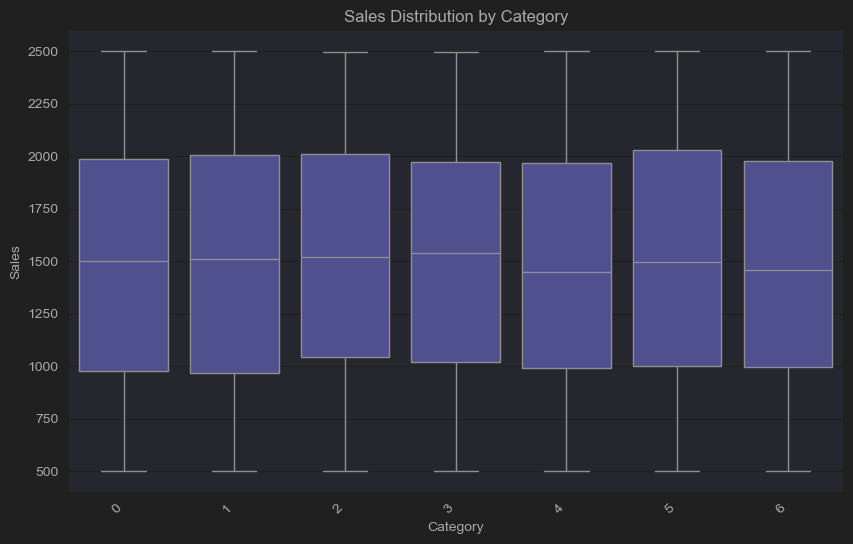
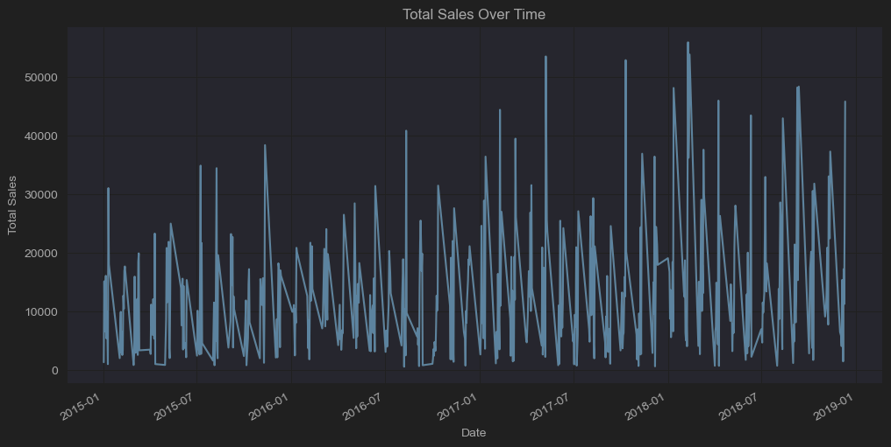
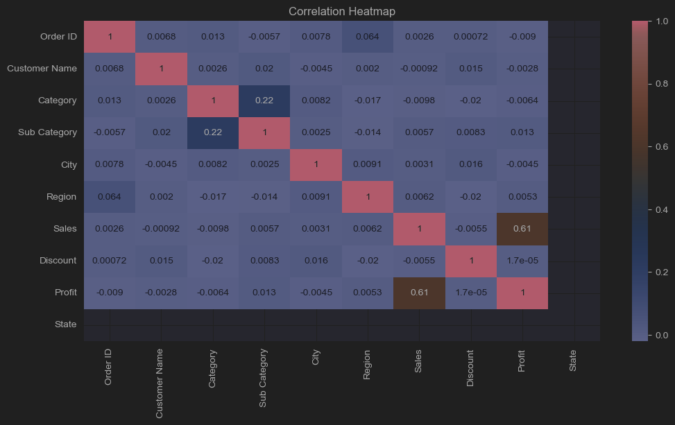
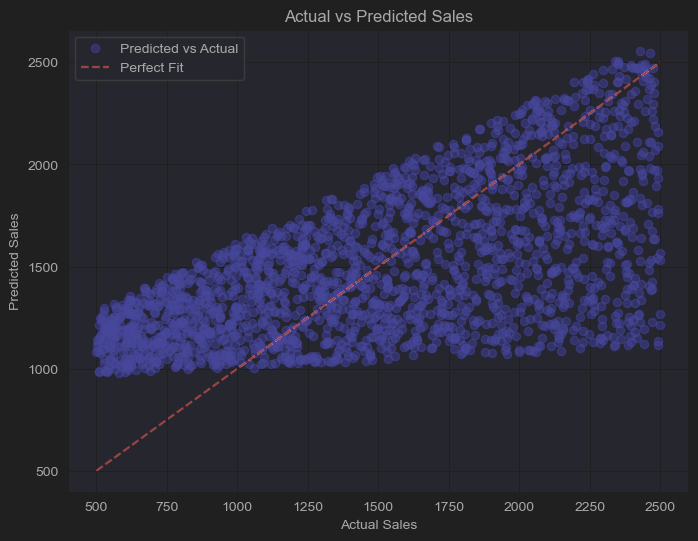

### Supermart Grocery Sales - Retail Analytics 
1. Project Overview
Objective:
This project aims to analyze sales data from the Supermart Grocery dataset, preprocess the data, train a Linear Regression model to predict sales, and visualize the results.
Dataset:
File: Supermart Grocery Sales - Retail Analytics Dataset.csv
Columns:
Order ID, Customer Name, Category, Sub Category, City, Order Date, Region, Sales, Discount, Profit, State

# Import libraries#
import pandas as pd
import numpy as np
import matplotlib.pyplot as plt
import seaborn as sns
from sklearn.model_selection import train_test_split
from sklearn. preprocessing import StandardScaler
from sklearn.linear_model import LogisticRegression
from sklearn. metrics import confusion_matrix,classification_report
from sklearn. preprocessing import LabelEncoder
from sklearn.linear_model import LinearRegression
from sklearn.metrics import mean_absolute_error, mean_squared_error, r2_score

## Step 2: Load the Dataset

Dataset Summary:
Source: Supermart Grocery Sales - Retail Analytics Dataset
Number of Entries: 9,994
Columns: Order ID, Customer Name, Category, Sub Category, City, Order Date, Region, Sales, Discount, Profit, State
data = pd.read_csv('Supermart Grocery Sales - Retail Analytics Dataset.csv')
data.head()
print(data.head())

Output:
Order ID Customer Name          Category      Sub Category         City  \
0      OD1        Harish      Oil & Masala           Masalas      Vellore   
1      OD2         Sudha         Beverages     Health Drinks  Krishnagiri   
2      OD3       Hussain       Food Grains      Atta & Flour   Perambalur   
3      OD4       Jackson  Fruits & Veggies  Fresh Vegetables   Dharmapuri   
4      OD5       Ridhesh       Food Grains   Organic Staples         Ooty   

   Order Date Region  Sales  Discount  Profit       State  
0  11-08-2017  North   1254      0.12  401.28  Tamil Nadu  
1  11-08-2017  South    749      0.18  149.80  Tamil Nadu  
2  06-12-2017   West   2360      0.21  165.20  Tamil Nadu  
3  10-11-2016  South    896      0.25   89.60  Tamil Nadu  
4  10-11-2016  South   2355      0.26  918.45  Tamil Nadu

## Step3. Data Preprocessing

Key Preprocessing Steps:
Removed non-essential columns: Order ID, Customer Name, and Order Date
Handled missing values (if any) using imputation or removal techniques
Converted categorical variables into numerical values using one-hot encoding
---
#1. Check for Missing Values and Handle Them
print(data.isnull().sum())

# Drop any rows with missing values
data.dropna(inplace=True)
# Check for duplicates
data.drop_duplicates(inplace=True)
                                   ---
Output:
Order ID         0
Customer Name    0
Category         0
Sub Category     0
City             0
Order Date       0
Region           0
Sales            0
Discount         0
Profit           0
State            0
dtype: int64

## 2. Convert Date Columns to DateTime Format
# Convert date columns to datetime format (if applicable)
if 'Date' in data.columns:
    data['Date'] = pd.to_datetime(df['Date'], errors='coerce', dayfirst=True)
if 'Order Date' in data.columns:
    data['Order Date'] = pd.to_datetime(data['Order Date'], errors='coerce', dayfirst=True)
if 'Ship Date' in data.columns:
    data['Ship Date'] = pd.to_datetime(data['Ship Date'], errors='coerce', dayfirst=True)

# Check data types
print("Data types:\n", data.dtypes)

Output:
Data types:
 Order ID                 object
Customer Name            object
Category                 object
Sub Category             object
City                     object
Order Date       datetime64[ns]
Region                   object
Sales                     int64
Discount                float64
Profit                  float64
State                    object
dtype: object

## 3. Label Encoding for Categorical Variables
# Encode categorical variables
label_encoder = LabelEncoder()
for col in data.select_dtypes(include=['object']).columns:
    data[col] = label_encoder.fit_transform(data[col].astype(str))

# Check data types
print("Data types:\n", data.dtypes)
# Summary statistics
print(data.describe())
# Check unique values in categorical columns
for col in data.select_dtypes(include=['object']).columns:
    print(f"{col}: {data[col].nunique()} unique values")

output:
Data types:
 Order ID                  int64
Customer Name             int64
Category                  int64
Sub Category              int64
City                      int64
Order Date       datetime64[ns]
Region                    int64
Sales                     int64
Discount                float64
Profit                  float64
State                     int64
dtype: object
          Order ID  Customer Name     Category  Sub Category         City  \
count  9994.000000    9994.000000  9994.000000   9994.000000  9994.000000   
mean   4996.500000      24.543326     3.015309     11.090855    11.429258   
min       0.000000       0.000000     0.000000      0.000000     0.000000   
25%    2498.250000      12.000000     1.000000      5.000000     6.000000   
50%    4996.500000      25.000000     3.000000     11.000000    11.000000   
75%    7494.750000      37.000000     5.000000     17.000000    17.000000   
max    9993.000000      49.000000     6.000000     22.000000    23.000000   
std    2885.163629      14.427712     2.008006      6.677107     6.931600   

                          Order Date       Region        Sales     Discount  \
count                           4042  9994.000000  9994.000000  9994.000000   
mean   2017-03-12 21:47:06.917367808     2.053132  1496.596158     0.226817   
min              2015-01-02 00:00:00     0.000000   500.000000     0.100000   
25%              2016-04-04 06:00:00     1.000000  1000.000000     0.160000   
50%              2017-05-02 00:00:00     1.000000  1498.000000     0.230000   
75%              2018-03-06 00:00:00     4.000000  1994.750000     0.290000   
max              2018-12-11 00:00:00     4.000000  2500.000000     0.350000   
std                              NaN     1.629766   577.559036     0.074636   

            Profit   State  
count  9994.000000  9994.0  
mean    374.937082     0.0  
min      25.250000     0.0  
25%     180.022500     0.0  
50%     320.780000     0.0  
75%     525.627500     0.0  
max    1120.950000     0.0  
std     239.932881     0.0

# #Step 4: Exploratory Data Analysis (EDA)
Objective
The goal of this analysis is to visualize the distribution of sales across different product categories using a box plot. This helps identify trends, outliers, and variations in sales performance among categories.

plt.figure(figsize=(10, 6))
# Set the color palette using 'color' instead of 'palette'
sns.boxplot(x='Category', y='Sales', data=data, color='blue')
plt.title('Sales Distribution by Category')
plt.xlabel('Category')
plt.ylabel('Sales')
plt.xticks(rotation=45, ha='right') # Rotate x-axis labels for better visibility
plt.show()

Output:

#2. Sales Trends Over Time
plt.figure(figsize=(12, 6))
# Convert 'Order Date' to datetime if it's not already
data['Order Date'] = pd.to_datetime(data['Order Date'])
data.groupby('Order Date')['Sales'].sum().plot()
plt.title('Total Sales Over Time')
plt.xlabel('Date')
plt.ylabel('Total Sales')
plt.show()

output:

# 3.Correlation_Heatmap

plt.figure(figsize=(12, 6))
# Select only numerical features for correlation
numerical_data = data.select_dtypes(include=['number'])

# Convert all numerical columns to numeric type, handling errors
for col in numerical_data.columns:
    numerical_data[col] = pd.to_numeric(numerical_data[col], errors='coerce')

corr_matrix = numerical_data.corr()
sns.heatmap(corr_matrix, annot=True, cmap='coolwarm')
plt.title('Correlation Heatmap')
plt.show()
Output:

# Check dataset columns
print("Columns in dataset:", data.columns)

# Define the correct target column (choose 'Sales' or 'Profit' based on your goal)
target_column = 'Sales'  # Change to 'Profit' if needed

# Define features (drop non-relevant columns)
X = data.drop(columns=[target_column, 'Order ID', 'Customer Name', 'Order Date'])  # Drop irrelevant columns
y = data[target_column]

# Convert categorical variables into numerical (one-hot encoding)
X = pd.get_dummies(X, drop_first=True)

# Split dataset
X_train, X_test, y_train, y_test = train_test_split(X, y, test_size=0.2, random_state=42)

# Train the model
model = LinearRegression()
model.fit(X_train, y_train)

# Make predictions
y_pred = model.predict(X_test)

# Evaluate the model
mae = mean_absolute_error(y_test, y_pred)
mse = mean_squared_error(y_test, y_pred)
r2 = r2_score(y_test, y_pred)

print(f"Mean Absolute Error: {mae}")
print(f"Mean Squared Error: {mse}")
print(f"R-squared Score: {r2}")

output:
Columns in dataset: Index(['Order ID', 'Customer Name', 'Category', 'Sub Category', 'City',
       'Order Date', 'Region', 'Sales', 'Discount', 'Profit', 'State'],
      dtype='object')
Mean Absolute Error: 379.2202959480539
Mean Squared Error: 212824.5973664153
R-squared Score: 0.3547183704729946

# Create scatter plot
plt.figure(figsize=(8, 6))
plt.scatter(y_test, y_pred, color='blue', alpha=0.5, label="Predicted vs Actual")

# Plot the ideal line (y = x) in red
plt.plot([min(y_test), max(y_test)], [min(y_test), max(y_test)], color='red', linestyle='dashed', label="Perfect Fit")

# Labels and title
plt.title('Actual vs Predicted Sales')
plt.xlabel('Actual Sales')
plt.ylabel('Predicted Sales')
plt.legend()
plt.grid(True)

# Show plot
plt.show()
output:

## Acknowledgment - 
We would like to express our sincere gratitude to all individuals and organizations who contributed to the successful completion of this Supermart Grocery Sales Analysis project.
Special Thanks To:Data Providers
We acknowledge the efforts of data sources that compiled and provided the Supermart Grocery Sales - Retail Analytics Dataset, enabling insightful analysis.
Open-Source Community
The use of open-source libraries such as Pandas, NumPy, Matplotlib, Seaborn, and Scikit-Learn significantly contributed to data processing, visualization, and analysis.
Guides & Mentors
Special thanks to instructors, online resources, and mentors who provided valuable guidance in data analytics, statistical modeling, and machine learning.

